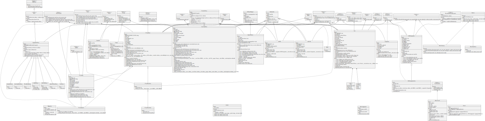

# DefiDollar


## Table of Contents
 - [Details](#details)
 - [Issues Summary](#issues-summary)
 - [Executive summary](#executive-summary)
     - [Documentation](#documentation)
     - [Meetings](#meetings)
 - [Scope](#scope)
 - [Highlevel code flow description](#highlevel-code-flow-description)
 - [Issues](#issues)
     - [[DFDComptroller] - Uniswap swapExactTokensForTokens wrong array size for path](#dfdcomptroller---uniswap-swapexacttokensfortokens-wrong-array-size-for-path)
     - [[DFDComptroller] - harvest() method is vulnerable to frontrunning](#dfdcomptroller---harvest-method-is-vulnerable-to-frontrunning)
     - [[DFDComptroller] - Optimize timestamp retrieval](#dfdcomptroller---optimize-timestamp-retrieval)
     - [[DFDComptroller] - Uniswap exchange will happen instantly](#dfdcomptroller---uniswap-exchange-will-happen-instantly)
     - [[Comptroller] - Improve management of beneficiary allocations](#comptroller---improve-management-of-beneficiary-allocations)
     - [[Comptroller] - Loop iteration can be improved](#comptroller---loop-iteration-can-be-improved)
     - [[DFDComptroller] - getReward method can save gas in certain situations](#dfdcomptroller---getreward-method-can-save-gas-in-certain-situations)
     - [Increase the number of tests](#increase-the-number-of-tests)
     - [Consider using an contract registry tracker](#consider-using-an-contract-registry-tracker)
     - [[ibDUSD] - Discussion of (future) potential flash loan attack vector](#ibdusd---discussion-of-future-potential-flash-loan-attack-vector)
     - [Aim to use modifiers only for checks](#aim-to-use-modifiers-only-for-checks)
 - [Artifacts](#artifacts)
     - [UML Diagram](#uml-diagram)
 - [License](#license)


## Details

- **Client** Yield Studio Pte. Ltd.
- **Date** December 2020
- **Lead reviewer** Daniel Luca (@cleanunicorn)
- **Reviewers** Daniel Luca (@cleanunicorn), Andrei Simion (@andreiashu)
- **Repository**: [DefiDollar](git@github.com:defidollar/defidollar-core.git)
- **Commit hash** `0dc7ea99f8e5e47e9f7b0ebc4a560854a98f52b0`
- **Technologies**
  - Solidity
  - Node.JS

## Issues Summary

| SEVERITY       |    OPEN    |    CLOSED    |
|----------------|:----------:|:------------:|
|  Informational  |  4  |  0  |
|  Minor  |  5  |  0  |
|  Medium  |  1  |  0  |
|  Major  |  1  |  0  |

## Executive summary

This report represents the results of the engagement with **Yield Studio Pte. Ltd.** to review **DefiDollar**.

The review was conducted over the course of **~1 week** from **December 8 to December 14, 2020**. A total of **4 person-days** were spent reviewing the code.

### Documentation

We received the following document which was updated during the review with more information and notes.
- [DefiDollar DAO Token (DFD) buyback vault proposal](https://forum.dusd.finance/t/defidollar-dao-token-dfd-buyback-vault/26)

### Meetings

The following meetings were recorded and reviewed later by the audit team:

- [Sync #1 recording](https://us02web.zoom.us/rec/share/1vqjTd906U-gpHC9vpwjpQcfbMdORzT1KsNnaNQyH8VGPDQxeKMkB7GIkyL_lcbn.M3oTUPbocGIip95n)
  - Passcode: `S$5tzUS#`

## Scope

The audit focused on an update of the codebase to [DefiDollar](git@github.com:defidollar/defidollar-core.git) identified by the commit hash `0dc7ea99f8e5e47e9f7b0ebc4a560854a98f52b0`.
 
**Closer look at**
- Comptroller.sol
- DFDComptroller.sol
- ibDFD.sol


We focused on manually reviewing the codebase, searching for security issues such as, but not limited to re-entrancy problems, transaction ordering, block timestamp dependency, exception handling, call stack depth limitation, integer overflow/underflow, self-destructible contracts, unsecured balance, use of origin, gas costly patterns, architectural problems, code readability.


## Highlevel code flow description

The new code introduced a `Comptroller.sol` contract, which splits the income revenue between `ibDUSD` and `DFDComptroller`. Users who stake DUSD and/or DFD tokens receive interest-bearing tokens (i.e., ibDUSD/ibDFD) and therefore are being rewarded interest from the Defi Dollar platform.

`Comptroller.harvest()` method calls `Core.harvest()` to mint new DUSD tokens if the total available system assets have increased. These newly minted DUSD tokens are then distributed by the `Comptroller` to `DFDComptroller` and `ibDUSD`.

In turn, the `DFDComptroller.harvest()` method uses the accrued DUSD to buy DFD tokens on the open market (Uniswap). These DFD tokens are then transferred to the ibDFD contract.

Another way the DFD supply can increase is through the liquidity mining mechanism whereby users of the platform receive DFD tokens for supplying liquidity.

<div style="page-break-after: always"></div>

## Issues


### [[DFDComptroller] - Uniswap swapExactTokensForTokens wrong array size for path](https://github.com/monoceros-alpha/audit-defi-dollar-2020-12/issues/2)
 

**Description**

The path variable is initialized with a size of 3 but only the first 2 slots are being used.

[Uniswap's documentation](https://uniswap.org/docs/v2/smart-contracts/router02/#swapexacttokensfortokens) mentions that if a direct pair exists for the swap, then one can just specify the direct path, i.e., an array of 2 elements, the first element being the input token and the last element the output token.

>Swaps an exact amount of input tokens for as many output tokens as possible, along the route determined by the path. The first element of path is the input token, the last is the output token, and any intermediate elements represent intermediate pairs to trade through (if, for example, a direct pair does not exist).


[code/contracts/stream/DFDComptroller.sol#L121-L129](https://github.com/monoceros-alpha/audit-defi-dollar-2020-12/blob/b333071efe533483eb99f8165e2cb2699647379c/code/contracts/stream/DFDComptroller.sol#L121-L129)
```solidity
            address[] memory path = new address[](3);
            path[0] = address(dusd);
            path[1] = address(dfd);

            uint[] memory amounts = Uni(uni).swapExactTokensForTokens(_dusd, uint256(0), path, address(this), now.add(1800));
            if (amounts[1] > 0) {
                dfd.safeTransfer(beneficiary, amounts[1]);
            }
            emit Harvested(_dusd, amounts[1]);
```


**Recommendation**

Change `path` variable to an array length of 2 elements:


[code/contracts/stream/DFDComptroller.sol#L121-L123](https://github.com/monoceros-alpha/audit-defi-dollar-2020-12/blob/b333071efe533483eb99f8165e2cb2699647379c/code/contracts/stream/DFDComptroller.sol#L121-L123)
```solidity
            address[] memory path = new address[](3);
            path[0] = address(dusd);
            path[1] = address(dfd);
```


---

<div style="page-break-after: always"></div>


### [[DFDComptroller] - harvest() method is vulnerable to frontrunning](https://github.com/monoceros-alpha/audit-defi-dollar-2020-12/issues/3)
 

**Description**

`DFDComptroller.harvest()` method is used to buy DFD tokens with the DUSD rewards accrued.

It does this by using [Uniswap's swapExactTokensForTokens](https://uniswap.org/docs/v2/smart-contracts/router02/#swapexacttokensfortokens) method to buy DFD from the DUSD/DFD liquidity pool.

An issue that was identified early in the presentation of the new code with the client is that `swapExactTokensForTokens` is called without specifying a minimum amount of `DFD` tokens to be bought (ie. `amountOutMin` param is set to 0).

This means that such a transaction can be frontrun by a malicious actor. This case is already described in the Uniswap Pricing Trades [documentation](https://uniswap.org/docs/v2/advanced-topics/pricing/#pricing-trades) :

> Say a smart contract naively wants to send 10 DAI to the DAI/WETH pair and receive as much WETH as it can get, given the current reserve ratio. If, when called, the naive smart contract simply looks up the current price and executes the trade, it is vulnerable to front-running and will likely suffer an economic loss. To see why, consider a malicious actor who sees this transaction before it is confirmed. They could execute a swap which dramatically changes the DAI/WETH price immediately before the naive swap goes through, wait for the naive swap to execute at a bad rate, and then swap to change the price back to what it was before the naive swap. This attack is fairly cheap and low-risk, and can typically be performed for a profit.


[code/contracts/stream/DFDComptroller.sol#L121-L125](https://github.com/monoceros-alpha/audit-defi-dollar-2020-12/blob/3c5a7e72b195e75fd518ab182b31afdf2eb3ce0a/code/contracts/stream/DFDComptroller.sol#L121-L125)
```solidity
            address[] memory path = new address[](3);
            path[0] = address(dusd);
            path[1] = address(dfd);

            uint[] memory amounts = Uni(uni).swapExactTokensForTokens(_dusd, uint256(0), path, address(this), now.add(1800));
```


The severity of this issue is somewhat reduced because if one wants to frontrun such a transaction, they themselves will be exposed to financial risk since they need to commit capital for 2 blocks and hope no arbitrage bot profits from their exposure.

Regardless, below we provide two solutions, one which is simple enough to implement, which remove the risk of being frontrun completely.

**Recommendation**

1. The simplest way to  ensure that the losses due to front-running are tightly bounded in the `harvest` method, is to expose the `amountOutMin` parameter to admin calling this method. Since `harvest` can only be executed by the owner of the contract (`onlyOwner` modifier) this user is already trusted. This is also [how the Uniswap frontend works](https://uniswap.org/docs/v2/advanced-topics/pricing/#pricing-trades) at the moment:

> This is how, for example, the Uniswap frontend ensure trade safety. It calculates the optimal input/output amounts given observed intra-block prices, and uses the router to perform the swap, which guarantees the swap will execute at a rate no less that x% worse than the observed intra-block rate, where x is a user-specified slippage tolerance (0.5% by default).

2. Another option is to let the contract automatically determine a fair price of DFD to be received with the downside of having to pay more gas: Uniswap's [ExampleSwapToPrice.sol](https://github.com/Uniswap/uniswap-v2-periphery/blob/master/contracts/examples/ExampleSwapToPrice.sol)

**References**

https://uniswap.org/docs/v2/advanced-topics/pricing/

---

<div style="page-break-after: always"></div>


### [[DFDComptroller] - Optimize timestamp retrieval](https://github.com/monoceros-alpha/audit-defi-dollar-2020-12/issues/9)
 

**Description**

There are a few instances where time is retrieved in the contract and could be improved.


[code/contracts/stream/DFDComptroller.sol#L133-L135](https://github.com/monoceros-alpha/audit-defi-dollar-2020-12/blob/b333071efe533483eb99f8165e2cb2699647379c/code/contracts/stream/DFDComptroller.sol#L133-L135)
```solidity
    function _timestamp() internal view returns (uint) {
        return block.timestamp;
    }
```


[code/contracts/stream/DFDComptroller.sol#L69](https://github.com/monoceros-alpha/audit-defi-dollar-2020-12/blob/b333071efe533483eb99f8165e2cb2699647379c/code/contracts/stream/DFDComptroller.sol#L69)
```solidity
        return Math.min(_timestamp(), periodFinish);
```


[code/contracts/stream/DFDComptroller.sol#L125](https://github.com/monoceros-alpha/audit-defi-dollar-2020-12/blob/b333071efe533483eb99f8165e2cb2699647379c/code/contracts/stream/DFDComptroller.sol#L125)
```solidity
            uint[] memory amounts = Uni(uni).swapExactTokensForTokens(_dusd, uint256(0), path, address(this), now.add(1800));
```


**Recommendation**

The `_timestamp` method can be removed completely and `block.timestamp` can be used instead directly.

The `now` usage is deprecated in Solidity 0.7.0 and `block.timestamp` is required. This will make your code more future-proof.

**[optional] References**


---

<div style="page-break-after: always"></div>


### [[DFDComptroller] - Uniswap exchange will happen instantly](https://github.com/monoceros-alpha/audit-defi-dollar-2020-12/issues/7)
 

**Description**

The `harvest` method is called by the owner to harvest the DUSD tokens and exchange them for DFD tokens. This is done by calling the Uniswap router method `swapExactTokensForTokens`.


[code/contracts/stream/DFDComptroller.sol#L125](https://github.com/monoceros-alpha/audit-defi-dollar-2020-12/blob/b333071efe533483eb99f8165e2cb2699647379c/code/contracts/stream/DFDComptroller.sol#L125)
```solidity
            uint[] memory amounts = Uni(uni).swapExactTokensForTokens(_dusd, uint256(0), path, address(this), now.add(1800));
```


The [Uniswap router documentation](https://uniswap.org/docs/v2/smart-contracts/router02/?#swapexacttokensfortokens) describes each argument of the `swapExactTokensForTokens`. 

The last argument is `deadline` which defines when the transaction should fail, if it stays in the mempool for too long. Because the function is not called directly by an external account, but the method is called by a contract, the `deadline` parameter can be set to `now`. This is valid according to the Uniswap `ensure` modifier which tests if the provided `deadline` is equal or higher than the current time. 


[contracts/UniswapV2Router02.sol#L18-L21](https://github.com/Uniswap/uniswap-v2-periphery/blob/69617118cda519dab608898d62aaa79877a61004/contracts/UniswapV2Router02.sol#L18-L21)
```solidity
    modifier ensure(uint deadline) {
        require(deadline >= block.timestamp, 'UniswapV2Router: EXPIRED');
        _;
    }
```


Because this is called by a contract, it happens instantly and a future `deadline` does not need to be provided.

**Recommendation**

Update the call to the Uniswap router to send `now` as the deadline, and not a future `deadline`.

Replace `now.add(1800)` with `now` when calling `swapExactTokensForTokens`.


[code/contracts/stream/DFDComptroller.sol#L125](https://github.com/monoceros-alpha/audit-defi-dollar-2020-12/blob/b333071efe533483eb99f8165e2cb2699647379c/code/contracts/stream/DFDComptroller.sol#L125)
```solidity
            uint[] memory amounts = Uni(uni).swapExactTokensForTokens(_dusd, uint256(0), path, address(this), now.add(1800));
```


**References**

- [Uniswap documentation](https://uniswap.org/docs/v2/smart-contracts/router02/?#swaptokensforexacttokens)

deadline | uint | Unix timestamp after which the transaction will revert.
-- | -- | --

- Uniswap implementation of deadline check


[contracts/UniswapV2Router02.sol#L18-L21](https://github.com/Uniswap/uniswap-v2-periphery/blob/69617118cda519dab608898d62aaa79877a61004/contracts/UniswapV2Router02.sol#L18-L21)
```solidity
    modifier ensure(uint deadline) {
        require(deadline >= block.timestamp, 'UniswapV2Router: EXPIRED');
        _;
    }
```


---

<div style="page-break-after: always"></div>


### [[Comptroller] - Improve management of beneficiary allocations](https://github.com/monoceros-alpha/audit-defi-dollar-2020-12/issues/6)
 

**Description**

The harvested revenue is split to the beneficiaries according to a defined allocation.


[code/contracts/stream/Comptroller.sol#L42-L44](https://github.com/monoceros-alpha/audit-defi-dollar-2020-12/blob/b333071efe533483eb99f8165e2cb2699647379c/code/contracts/stream/Comptroller.sol#L42-L44)
```solidity
            for (uint i = 0; i < beneficiaries.length; i++) {
                dusd.safeTransfer(beneficiaries[i], revenue.mul(allocations[i]).div(MAX));
            }
```


This allocation can be updated by the owner of the contract using 2 methods: 
- `addBeneficiary` which adds a new beneficiary to the list, along with the new allocation for all of the existing beneficiaries (including the newly created one)
- `modifyAllocation` which modifies the allocation for the existing beneficiaries

If, for example, a beneficiary needs to be replaced, or removed, its allocation will be updated by calling `modifyAllocation` and setting its allocation index to the value zero.

In case that happens, the revenue distribution will still loop over the beneficiary array, but it will send `0` tokens and iterate to the next beneficiary. The beneficiary array is always appended to, never replaced and items are never removed. Because of this, once a beneficiary was added to be distributed to, it will always be looped over, even if its distribution is `0`.

**Recommendation**

Because the allocation is already replaced as an array, it will not be a significant and risky change to also replace the beneficiary array. This way the 2 methods can be replaced by one method which will update the beneficiary list and their allocations, in one call.


---

<div style="page-break-after: always"></div>


### [[Comptroller] - Loop iteration can be improved](https://github.com/monoceros-alpha/audit-defi-dollar-2020-12/issues/5)
 

**Description**

The `harvest()` method loops over all the beneficiaries and transfers the total revenue according to the defined proportions.


[code/contracts/stream/Comptroller.sol#L42-L44](https://github.com/monoceros-alpha/audit-defi-dollar-2020-12/blob/b333071efe533483eb99f8165e2cb2699647379c/code/contracts/stream/Comptroller.sol#L42-L44)
```solidity
            for (uint i = 0; i < beneficiaries.length; i++) {
                dusd.safeTransfer(beneficiaries[i], revenue.mul(allocations[i]).div(MAX));
            }
```


The loop ends when all of the beneficiaries have been processed.

The end of the loop does not change while the transfers are made; thus, the end of the loop can be cached to save gas.

The same principle applies to the `earned` method.


[code/contracts/stream/Comptroller.sol#L51-L55](https://github.com/monoceros-alpha/audit-defi-dollar-2020-12/blob/b333071efe533483eb99f8165e2cb2699647379c/code/contracts/stream/Comptroller.sol#L51-L55)
```solidity
            for (uint i = 0; i < beneficiaries.length; i++) {
                if (beneficiaries[i] == account) {
                    return revenue.mul(allocations[i]).div(MAX);
                }
            }
```


A test contract was deployed with Remix to describe the gas impact.

```solidity
contract LoopEndNoCache {
    uint[] public numbers;

    function setBeneficiaries(uint[] memory _numbers) public {
        numbers = _numbers;
    }

    // Looping over 10 items costs 23961 gas
    // Looping over 2 items costs 6132 gas
    function loop() public view returns (uint) {
        uint sum = 0;
        for (uint i=0; i < numbers.length; i++) {
            sum = sum + numbers[i];
        }
        return sum;
    }
}

contract LoopEndCache {
    uint[] public numbers;

    function setBeneficiaries(uint[] memory _numbers) public {
        numbers = _numbers;
    }

    // Looping over 10 items costs 16772 gas
    // Looping over 2 items costs 4543 gas
    function loop() public view returns (uint) {
        uint sum = 0;
        uint numbersLength = numbers.length;
        for (uint i=0; i < numbersLength; i++) {
            sum = sum + numbers[i];
        }
        return sum;
    }
}
```

**Recommendation**

Cache the end of the loop instead of making the EVM request the array length at each iteration.

i.e.

```solidity
uint beneficiariesLength = beneficiaries.length;
for (uint i = 0; i < beneficiariesLength; i++) {
```


---

<div style="page-break-after: always"></div>


### [[DFDComptroller] - getReward method can save gas in certain situations](https://github.com/monoceros-alpha/audit-defi-dollar-2020-12/issues/4)
 

**Description**

`DFDComptroller.getReward` method is called from both `ibDFD.deposit` and `ibDFD.withdraw` methods which are called when a user performs those actions.

The amount of `reward` accrued is calculated by subtracting the `rewardPaid` from the `rewardStored` state variable ( `L78` ).


[code/contracts/stream/DFDComptroller.sol#L73-L82](https://github.com/monoceros-alpha/audit-defi-dollar-2020-12/blob/b333071efe533483eb99f8165e2cb2699647379c/code/contracts/stream/DFDComptroller.sol#L73-L82)
```solidity
    function getReward()
        external
        updateReward
    {
        require(msg.sender == beneficiary, "GET_REWARD_NO_AUTH");
        uint reward = rewardStored.sub(rewardPaid);
        rewardPaid = rewardStored;
        dfd.safeTransfer(beneficiary, reward);
        emit RewardPaid(beneficiary, reward);
    }
```


The issue is that when there is no additional rewards accrued and `reward` variable is 0 there is unnecessary code executed and an event is being emitted which can confuse any users relying on it.

**Recommendation**

Next lines of code should only be executed if the `reward` variable is greater than 0. This avoids unnecessary execution of code and emitting an event for a 0 value reward.


---

<div style="page-break-after: always"></div>


### [Increase the number of tests](https://github.com/monoceros-alpha/audit-defi-dollar-2020-12/issues/11)
 

**Description**

There is some functionality that, at the moment, isn't tested; however, it is critical for the whole system to work together.

**Recommendation**

Increase the number of tests and make sure the active code coverage (not taking into account the proxy contracts) is close to 100%.


---

<div style="page-break-after: always"></div>


### [Consider using an contract registry tracker](https://github.com/monoceros-alpha/audit-defi-dollar-2020-12/issues/10)
 

**Description**

This is a pattern that is not a recommendation, but its purpose is to inform of a way to track, save and handle contract instances that a contract needs to interact with.

Consider this mapping where the contract is compiled with a list of predefined addresses.


[code/contracts/stream/DFDComptroller.sol#L40-L44](https://github.com/monoceros-alpha/audit-defi-dollar-2020-12/blob/b333071efe533483eb99f8165e2cb2699647379c/code/contracts/stream/DFDComptroller.sol#L40-L44)
```solidity
    address public uni = address(0x7a250d5630B4cF539739dF2C5dAcb4c659F2488D);
    address public beneficiary; // ibDFD
    IERC20 public dfd = IERC20(0x20c36f062a31865bED8a5B1e512D9a1A20AA333A);
    IERC20 public dusd = IERC20(0x5BC25f649fc4e26069dDF4cF4010F9f706c23831);
    IComptroller public comptroller;
```


This code needs to be updated before the final deployment with the updated addresses. This not only makes testing difficult but impossible because the addresses are not set in the contract and the functionality that relies on correct addresses cannot be tested. 

A different approach to provide the correct addresses of the needed contract deployments can be achieved by creating a centralized contract registry, which can be called by any contract. This registry will be able to provide the latest implementation for each contract. Consider it a glorified list mapping having a contract name as an argument and returning an address representing that contract's instance on the blockchain.

Example of a registry contract.

```solidity
contract DefiDollarMasterLedger {
    address public owner;
    
    modifier onlyOwner() {
        require(owner == msg.sender, "Only the owner can update addresses");
        _;
    }
    
    constructor() public {owner = msg.sender;}
    
    mapping (bytes32 => address) contractMapping;
    
    // Call this to return the latest contract instance
    function getLatestAddress(bytes32 _contractName) public view returns (address) {
        return contractMapping[_contractName];
    }
    
    // Define all contracts with this call
    function setLatestAddress(bytes32 _contractName, address _address) public onlyOwner {
        contractMapping[_contractName] = _address;
    }
}
```

This could then make the previous code be updated to something similar to this.

```solidity
contract DFDComptroller {
    address public immutable uni;
    address public immutable beneficiary;
    IERC20 public immutable dfd;
    IERC20 public immutable dusd;
    IComptroller public immutable comptroller;

    constructor(DefiDollarMasterLedger _masterLedger) public {
        uni = _masterLedger.getLatestAddress("UniswapMarket");
        beneficiary = _masterLedger.getLatestAddress("ibDFD");
        dfd = IERC20(_masterLedger.getLatestAddress("DFD"));
        dusd = IERC20(_masterLedger.getLatestAddress("DUSD"));
        comptroller = IComptroller(_masterLedger.getLatestAddress("Comptroller"));
    }
}
```

This obviously uses the Solidity `immutable` feature that makes sure the variables are saved in the bytecode, and the values are added at deploy time in the correct places. This would make sure the gas costs are the same as they are right now (having `constant` variables) while providing the flexibility to set the values at deploy time, while also providing a way for easy testing, mocking, plug and play of different implementations.

If the `immutable` feature is unavailable (because Solidity `0.5.17` does not support it), or the `constructor` not available (because of a specific upgradability pattern), a different approach can be made, admittedly having higher gas costs, while retaining the plug and play flexibility.

The contract can have a public function that obtains one or more addresses and stores them in its local state.

```
contract DFDComptrollerCache {
    address public uni;
    address public beneficiary;
    IERC20 public dfd;
    IERC20 public dusd;
    IComptroller public comptroller;    
    
    function updateAddresses() public {
        DefiDollarMasterLedger _masterLedger = DefiDollarMasterLedger(0x7EF2e0048f5bAeDe046f6BF797943daF4ED8CB47);
        
        uni = _masterLedger.getLatestAddress("UniswapMarket");
        beneficiary = _masterLedger.getLatestAddress("ibDFD");
        dfd = IERC20(_masterLedger.getLatestAddress("DFD"));
        dusd = IERC20(_masterLedger.getLatestAddress("DUSD"));
        comptroller = IComptroller(_masterLedger.getLatestAddress("Comptroller"));
    }
}
```

This will add ~800 gas cost each time the address is retrieved from the storage (because SLOAD costs 800 gas).

**Recommendation**

This isn't a recommendation to change the current pattern, but a tool to add to your inventory to be aware of and spark discussion on improving testing and upgradability. 

The system may become really complex in the future and a centralized address mapping is useful. At the moment, there's no clear list of how the contracts are linked together, a personal knowledge of the system needs to be in place already.


---

<div style="page-break-after: always"></div>


### [[ibDUSD] - Discussion of (future) potential flash loan attack vector](https://github.com/monoceros-alpha/audit-defi-dollar-2020-12/issues/8)
 

**Description**

We'd like to further discuss what we believe might be a non-issue but thought it's worth investigating together with Arpit.

Imagine the following flow of contract interactions, all within one transaction. Please note the (*) at the end:

1. borrow a lot of DUSD from Uniswap's DUSD/DFD pool
1. ibDUSD.deposit DUSD: receive ibDUSD tokens
1. borrow again DUSD from Uniswap's DUSD/DFD pool
1. ibDUSD.deposit DUSD: receive a lot more ibDUSD tokens bc there was an increased amount of `earned` DUSD reward that has been distributed to ibDUSD (caveat: see (*) below)
1. ibDUSD.withdraw all DUSD deposited (it will burn my ibDUSD)
1. return borrowed DUSD to Uniswap
1. I should have extra DUSD now

(*) this is most probably a non-issue since Core.totalSystemAssets() does not include amount of dusd in ibDUSD contract (only includes amount of DUSD from peak(s)). Therefore the `Core.harvest()` method will not mint new `dusd` when a user deposits more `dusd` in the ibDUSD contract.

Basically we're trying to make sure that:

1. our understanding (*) above is correct
1. the client is aware that this becomes an attack vector if for some reason in the future, the architecture of the system changes and somehow the DUSD stored in ibDUSD contract is being included in the calculation of `totalSystemAssets()` - this might not make sense anyway, but better to discuss it early.


---

<div style="page-break-after: always"></div>


### [Aim to use modifiers only for checks](https://github.com/monoceros-alpha/audit-defi-dollar-2020-12/issues/1)
 

**Description**

There are several instances where code that updates state is encapsulated as a modifier (eg. `DFDComptroller.updateReward`, `ibDFD.getReward`, `ibDUSD.harvest`).

Although we haven't found any security issues with the code in these cases, this practice is an anti-pattern that can lead to harder to read code and potential security issues in the future.

For example in `ibDUSD` the `harvest` modifier calls `Comptroller.harvest()` method which in turn changes the state of the contract.


[code/contracts/stream/ibDUSD.sol#L28-L31](https://github.com/monoceros-alpha/audit-defi-dollar-2020-12/blob/b333071efe533483eb99f8165e2cb2699647379c/code/contracts/stream/ibDUSD.sol#L28-L31)
```solidity
    modifier harvest() {
        controller.harvest();
        _;
    }
```


[code/contracts/stream/Comptroller.sol#L29-L46](https://github.com/monoceros-alpha/audit-defi-dollar-2020-12/blob/b333071efe533483eb99f8165e2cb2699647379c/code/contracts/stream/Comptroller.sol#L29-L46)
```solidity
    /**
    * @notice Harvests all accrued income from core and transfers it to beneficiaries
    * @dev All beneficiaries should account for that fact that they can have dusd transferred to them at any time
    * @dev Any account call harvest
    */
    function harvest() external {
        // address(this) needs to be the authorizedController() in core
        core.harvest();

        // any extraneous dusd tokens in the contract will also be harvested
        uint revenue = dusd.balanceOf(address(this));
        emit Harvested(revenue);
        if (revenue > 0) {
            for (uint i = 0; i < beneficiaries.length; i++) {
                dusd.safeTransfer(beneficiaries[i], revenue.mul(allocations[i]).div(MAX));
            }
        }
    }
```


In this case, removing the modifier from `ibDUSD` and calling `controller.harvest()` directly has the benefit of making the code easier to read and understand.

**Recommendation**

[It is recommended](https://consensys.net/blog/blockchain-development/solidity-best-practices-for-smart-contract-security/#use-modifiers-only-for-checks) to keep any state changes outside of modifiers.

In most cases, code that changes state that is present in modifiers can easily be moved to function blocks without too much development time invested.


---

<div style="page-break-after: always"></div>


## Artifacts

### UML Diagram

Generated with [sol2uml](https://github.com/naddison36/sol2uml):

```bash
npm link sol2uml --only=production
sol2uml ./code/contracts
```



## License

This report falls under the terms described in the included [LICENSE](https://www.apache.org/licenses/LICENSE-2.0.txt).
